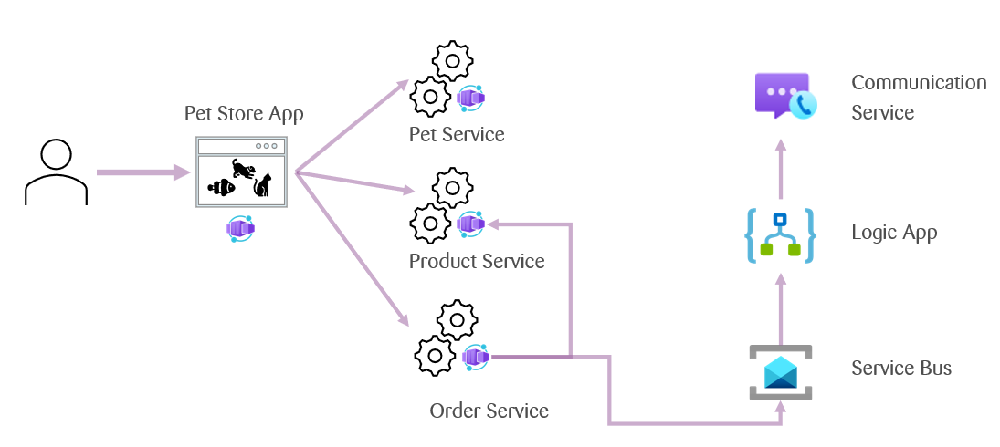

# Intro
Welcome to this Azure Fundamentals Workshop.
During this workshop we will deploy a Pet store application.

## Application Architecture
The Petstore application is designed with a microservices architecture.
The frontend service called `petstoreapp` connects to three backend services called `petservice`, 
`productservice`, and `orderservice`.
In addition, backend service `orderservice` connects to the `orderservice`.

## Container App Service & Kubernetes
The most widely used container orchestration system today is Kubernetes.
The main drawback of kubernetes is its complexity.
Container Apps are a managed Azure service built on top of Kubernetes.
They mostly abstract away the complexities of working with Kubernetes.
In this workshop we will be deploying our Petstore with Azure Container Apps.

## Team Azure Structure 
We are using a single subscription where each team has its own resource group.
Each team has been assigned a team number.
When creating resources in Azure, you will need to name most of them.
Occasionally, some of these names must be globally unique.
To avoid most naming conflicts, a reliable method is to include your team number in the resource name.

## Agenda
1. Intro
2. Understanding what we are deploying
3. Build & Run the Petstore locally
4. Set up Azure access
5. Create Azure Container Registry
6. Push the docker images into the registry
7. Create Container Apps Environment
8. Create Container App for the frontend microservice
9. Connect to the frontend service
10. Create Container Apps for a backend microservices
11. Scaling up and down
12. Email sending with Logic App

## Acceptance Criteria
1. You have an understanding of what we are deploying
2. You know your resource group

## Acknowledgement 
This workshop is an adaptation of the Azure Petstore project.
The Azure Petstore is a demo application provided by Microsoft to showcase various Azure services and capabilities.
You can learn more about it and access the resources at [Azure Petstore GitHub Repository](https://github.com/chtrembl/azure-cloud/tree/main). 
